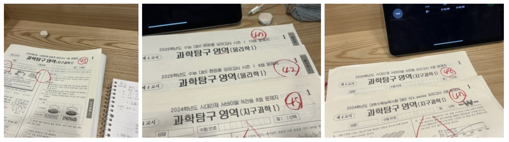
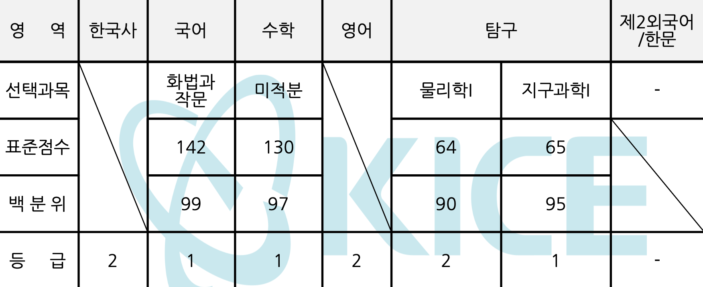
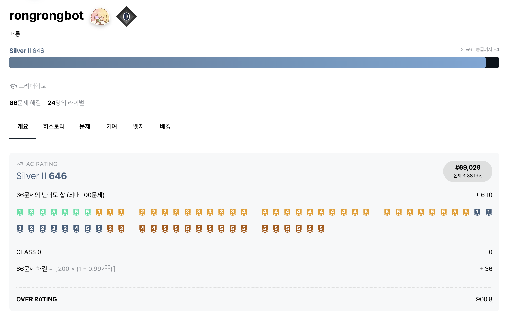
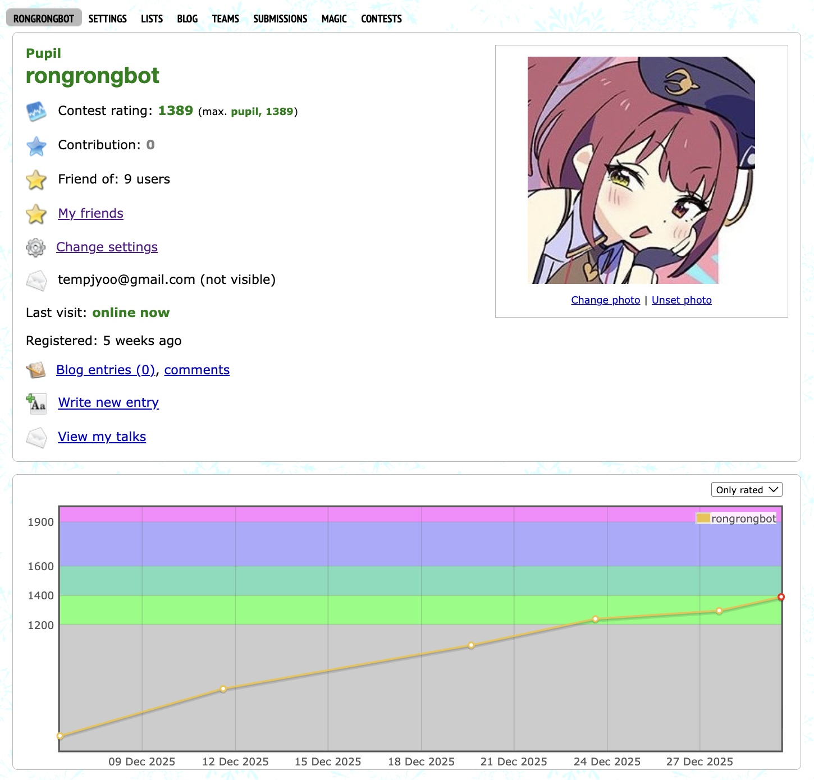

# 2025년 회고

다사다난했던 2025년이 막을 내리고 2026년이 되었습니다.
원래는 회고를 연말에 써 올리려고 했는데 미루고 미루다가 이렇게 26년이 되어버렸네요.
아무튼 조금 늦었지만 회고를 써보려고 합니다. 사실 25년에는 수능 말고 이뤘다고 말할만한 게 딱히 없어서 수능 얘기만 가득할 것 같지만요!

윗 문단에는 다사다난했다고 적었지만, 돌이켜 보면 별 일이 없긴 했습니다. 24년의 저는 정말로 수능을 한 번 더 보고 싶지 않았어서 1월에는 수능을 망쳐서 소중한 1년을 날리게 된다는 자책과 거기서 비롯된 우울함만이 가득했던 것 같아요. 이렇게까지 했는데 한 과목때문에 또 수능을 봐야한다는게 말이 되냐는 생각을 많이 했네요. 이때 학교가 마음에 안 든다는 얘기나 수능을 망쳤다는 얘기 같은 것들을 굉장히 무례한 언행으로 한 점 반성하고 있습니다. 같은 학교 선배 앞에서 하면 안 됐던 말들이 많았는데 견뎌주신 분들 정말 감사하고 죄송합니다. 

당시에는 1년 꿇는 게 하늘이 무너지는 일 같았는데 지나고보니 별 일 아니었습니다. 어쩌다보니 회고가 아니라 반성문을 쓰고 있네요. 수능때문에 정신적으로 힘들다는 핑계로 자학 겸 막말을 많이 했는데 제 말들에 상처입으셨던 분이 있다면 죄송해요. 그리고 다시 말하지만 견뎌주셔서 감사합니다.

봄부터는 그래도 나름 나아진 상태로 한 해를 보냈던 것 같아요. 봄부터의 경험은 대체로 저에게 다 살면서 처음 하는 일들이었어서 새롭고 행복하고 또 그런 만큼 무섭고 불안했었는데 정말 무엇이랑도 바꿀 수 없는 소중한 추억이 되었네요. 대신 그런 소중한 경험들을 한 대가로 공부를 안 했습니다. 그렇지만 아름다웠으니 괜찮다고 생각합니다. 지나고 보면 이런 기억들로 살아가게 되더라고요.

전액 장학이 가능해서 관리형 독서실 잇올에 잠시 들어갔었는데, 안 맞아서 그대로 나왔고.. 저는 25수능 직후부터 26수능 공부를 시작했는데, 11-1월동안 한 공부가 2-9월동안 한 공부가 많은 것 같아요. 폐급 반수생이었죠. 괜히 다른 사람들이 수능 직후에는 놀라고 하는 게 아닙니다.. 그때 안 놀면 상반기에 놀게 돼요. ㄱ-... 뭐 놀러다녔으니 당연히 6모는 말아먹었고요, 이 기간에는 독서실보다 서울대입구에 더 성실히 다녔네요 나는 서울대생도 아닌데.. 아 그리고 이때쯤 주식도 처음 시작해서 재미를 봤어요. 물론 막 몇천만원 굴린 건 아니고, 30만원으로 아마스빈 월 두잔정도 뽑아먹음. 이것도 아마 6,9모 말아먹은 원인 중 하나라고 생각이 들긴 합니다. 

다시 수험 얘기로 돌아오자면 6모에서는 지구과학 3~(4였나? 잘 기억 안 남)~, 9모에서는 4.. 나머지야 뭐 사실 재수할 이유 없이 잘했던 과목이니까 상관없었어요. 근데 이제 지구과학 때문에 재수하는거다 보니까 지구과학 꼴도 보기 싫고, 그니까 안 하고, 그랬더니 더 꼴도 보기 싫고.. 이런 상황이 반복됩니다. 악순환이죠. 하지만 수능은 다가오고 지구를 또 4 받으면 복학은 필연입니다. 그래서 9월 둘째주부터는 울며 겨자먹기로 공부를 하게 됩니다. 

나름 열심히 했어요. 개념 다시 듣고 사설 모고 풀고.. 초반에는 30점대를 영영 탈출하지 못할 것 처럼 보였는데 어쩌다보니 40점대로 올라오고 뭐 그랬네요. 사실 11월 말쯤에 가서는 사설모고 폼이 나름 괜찮아서 - 저점 찍히면 설공 고점 찍히면 의머 같은 느낌으로다가 - 기대를 좀 했는데 뭐 고점의 행운같은건 없었습니다. 불만이 있는 건 아니고요, 아쉽긴 하지만 그래도 25 수능보다 잘 봤으니 다행이라고 생각합니다. 그때의 경험으로 수능에서 안 망하기가 생각보다 쉽지 않다는 것을 알았기 때문에.. 국어때문에 멘탈이 아파서 수학을 말았는데, 국어는 100이라니 좀 아이러니하긴 하네요. 수학까지 치고 나서는 그냥 복학하면 그만이야~ 라고 하면서 마음을 나름 비우고 영어랑 물리를 쳤습니다. 근데 물리가 어려워서 망했어요. 아까까지 복학하면 그만이라고 정신승리를 했지만 막상 진짜 복학 확정 땅땅땅. 상태가 되니 멘탈이 다시 아파오기 시작합니다. 그래도 공부한 보람이 있게 지구를 잘 봤습니다. 멘탈 이슈로 마킹을 하나 실수하긴 했다만 제가 뭐 늘 그렇죠 ㅎ 이정도면 대 만족

성적표가 나오면서 마킹 불안이 끝나고~.. 결론적으로 처음 시작할때 목표로 잡았던 인설치에는 못 미치지만 작년보다는 좋은 성적을 받아서 아마도 학교를 옮기게 될 것 같습니다. 메데타시 메데타시

그 이후 11,12월에 있었던 이벤트는.. 딱히 없네요. PS 복귀랑 혹 발견 이벤트 정도? 무려 2년 반 만에 PS를 다시 시작하게 되었습니다. 와!

제.. 아름다운 새삥 계정 보시죠. 성실히 문제를 안 풀어서 아직도 실버입니다. 다시 시작하는거 막막했는데 너무너무 감사하게도 실버님이 종종 도와주셔서 뭔가 하고 있어요. 늘 그런데 제가 이런 고급..인력을..낭비해도..되나.. 라는 생각을 하게 되는 것 같습니다..ㄱ- 누추한 롱롱봇에게 이런 귀한 분이? 같은 느낌이죠. 그리고 솔브드 디코에서 만난 분들이랑도 종종 이야기하곤 해요 요즘은. 제가 원래 CP를 즐겨 하는 사람이 아니었는데 다른 분들이랑 얘기하고 하다보니 재미를 붙인 것 같아요. 성실히 Codeforces 라운드를 치고 있습니다. 

짠..배치를 한달만에 다 쳤어요. 배치 음수델타는 좀 마음 아프긴 한데.. 사실상 민트에서 시작이니 그린으로 떨궜다 올렸다 떨궜다 반복한 느낌이죠. 굿바이 2025에서 legendre 헛 짓 을 하는 바람에 이리 되었습니다. 3솔을 해도 퍼포가 그레이가 나온다고? 를 두 번이나 했고요. 열심히 해서 올해는 블루나 퍼플을 달고 싶어요. 물론 아직 민트도 못 달았지만... 뭐 조만간 달지 않을까요? 아! 오프라인 대회에도 관심이 가요. ICPC 본선도 나가보고 싶고, UCPC도 해보고 싶고, 이것저것 해보고 싶은 게 참 많습니다. 팀만 생긴다면 말이죠! 제발 누군가 저를 납치해 주세요.

회고는 여기까지입니다. 글을 쓸 때 마다 느끼는 건 시작하는 것보다 잘 마무리 짓는 것이 어려워요. 계획도 퇴고도 없이 즉석에서 후루룩 써내려간 글이라 잘 읽힐지는 모르겠지만, 읽어주셔서 정말로 감사합니다. 모두 2025년 한 해 수고 많으셨고 또 부족한 저랑 함께해 주어서 고맙습니다. 2026년에도 모쪼록 잘 부탁드려요! 새해 복 많이 받으시고요, 올해도 신세 한 번 지겠습니다. 작년과는 뭔가 달라지는 걸 보여드릴테니, 저랑 부디 친하게 지내 주세요(_ _)!!