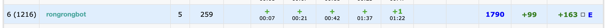
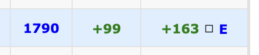
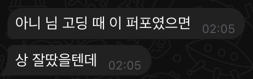

# Codeforces Round 1072 (Div. 3) 후기
오늘은 코포 후기입니다 
원래는 귀찮아서 코포 업솔빙도 잘 안하고(죄송합니다) 후기도 안 쓰는데요 오늘 퍼포 고점을 찍어서 신나가지고 새벽 2시 34분에 블로그를 적고 있습니다. 하하

블루퍼포라니.. 너무 신남

엄청나죠 제 위에서 다 핵 당해서 델타 +100 됐으면 좋겠어요

### A 00:07 AC
코포 전에 씻다가 물이 너무 따뜻해서.. 지각했습니다. 한 2분인가 늦은 것 같아요. 칠 수 있는 코포는 모두 친다는 정책을 펼치고 있기 때문에 그냥 늦건 말건 시작했습니다. 처음에 뭔소린가 잠깐 고민하다가 n>=4 기점으로 케웍 하면 된다는 사실을 깨닫고 짜서 7분에 AC를 받았습니다. 채점이 좀 늦게 돌았는데 옛날에 A가 한시간 시점에 채점되더니 터져서 그레이 퍼포가 찍히는 대참사를 경험한 적이 있어서 살짝 쫄았네요..

### B 00:21 AC
처음에 혼자 이상한 방향으로 케이스워크를 하다가.. 잘못됨을 깨닫고 바른 길로 돌아와서 맞췄습니다. 마지막 뒤집기 시점으로부터 m분까지 남은 시간과, 마지막 뒤집기 시점의 상태만 알아내주면 됩니다.

### C 00:42 AC
이것도 뻘짓을 했는데.. 쓰다보니 모든 문제에서 뻘짓을 한 것 같습니다. 모든 문제에서 뻘짓을 하지 않았다면 퍼플 퍼포였을지도..는 제 정체성이 뻘짓이기 때문에 그런 일은 일어나지 않겠죠.. 올림하는 경우를 고려하지 않아서 틀릴 뻔 했지만 다행히 예제가 걸러줘서 살았습니다. k에서 올라갔을 때 가능한 상태 범위에 n이 포함되는지 확인해주면 됩니다.

### E 01:22 +1 AC
삽질을 좀 많이 했던 문제입니다. D를 읽고, 저는 저번 Hello에서 게임이론의 쓴맛을 봤기 때문에 지문 읽자마자 E로 도망갔습니다. 한때 제가 DSU 조아 인간이었던 시절이 있었는데 그때 풀었던 문제랑 뭔가 비슷해 보여서 그대로 풀기 시작했습니다. 큰거부터 슉슉 해주면 돼요. 01:16에 로직 자체는 AC인 코드를 짰는데 사이즈 찾을 때 find를 안하고 parent를 찾고 있어서 1WA를 받았습니다. 변명을 하자면 너무 오랜만에 DSU 문제를 풀어서 그래요.. 아마도? 아무튼 그거 고쳐서 AC를 받았어요. 빨리 찾아서 다행입니다 

### D 01:37 AC
사실 E풀고 모든 의욕을 잃어서 자러 갈까 했는데 생각보다 D가 할만해서 풀었습니다. 풀고 나서 페널티 생각하면 차라리 D를 먼저 풀걸 같은 생각이 들었어요. 다 풀고 나서 핵당한다 이런 얘기들이 있어서 굉장히 쫄았는데 다행히 아닌가봐요! 솔브드에 올렸다가 두부님께서 제 코드를 보셨더라고요 쫄았는데 지금은 안심했어요.. ~다음에 혹시 승급할 것 같으면 모른척 조용히 있어야지 히히~

### G ~ 
그리고 친창에 계신 어떤 분들께서 F는 틀리고 G는 풀고.. 이런 상태시길래 저도 G를 잡았습니다. F 트리DP라는데 저는 DP가 싫어요. 그리고 G가 세그트리인게 눈에 딱 보여서 G를 긁어보기 시작합니다. 이탐 세그인거까진 알겠는데 짜다가 망한 것 같아요. 사실 아직 세그트리 뭐하는건지 잘 몰라서 원래 망해야하는걸 로그로 바꿔주는 마법의 알고리즘 정도로 인식하고 있어요. 그래서 그냥 과거의 제가 파차님한테 배울때 금광세그였나..하여간 짰던걸로 약간씩 고쳐서 돌려 막고 있습니다. 근데 그래서 그런가 안돌아가더라고요? 다른사람들 코드 까보니까 이탐은 제대로 짠 것 같은데 세그에서 터지는 것 같아요. 

슬픈 말을 들었어요 그리고 ㅠㅠ
근데 함정: 사실 오늘 퍼포가 개뽀록으로 나온거라서 다음 코포에서는 다시 민트그린그레이로 회귀할거라는 사실입니다... 마음 아프지만 현실이에요 E DSU 나와서 정말 뽀록으로 찍은 퍼포...
열심히 해서 나중에는 이 퍼포가 저점이 됐으면 좋겠네요! 진짜 후기 끝 