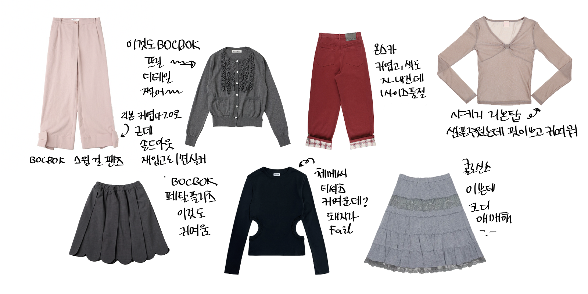

# 롱상 

블로그가 여러모로 상태가 안 좋아서 고쳐야겠다고 다짐만 하고 그대로 까먹고 있었습니다. 그렇게 블로그를 고치지 못한 채로 2월의 절반이 지났습니다. 사실 고치는 것도 Opus(감사하게도 파차님이 제가 Opus를 쓰며 분노하는 걸 보고 싶으시다고 후원 해주셨어요)가 하기 때문에 저는 별로 할 것도 없긴 합니다만, 생각보다 Opus가 멍청해서 쉽지가 않습니다. 2월이 다 가기 전에는 블로그를 꼭 좀 이쁘게 고쳐 보겠습니다. 이렇게 쓰면 뭐라도 하지 않을까요? 물론 게으른 제가 또 미룰 수도 있겠지만요. 뭘 쓸까 하다가 일단은 대충 근 3달 내 최근의 일상과 제 생각들을 써보도록 하겠습니다. 

### 재수를 마무리하며
또 입시 글을 적게 되다니 정말로 수능 망령이 되어가고 있는 것 같아서 기분이 좋지가 않습니다. 그치만 죄수생이 일상 글을 쓰면 입시 얘기를 빼놓기가 어렵다구요. 양해 바랍니다. 대망의 12월 5일, 슈뢰딩거의 수능 성적표를 까보니 좋은 소식과 나쁜 소식이 동시에 찾아왔습니다. 좋은 소식은 지구과학 마킹이고, 나쁜 소식은 화작 만점 표점이 142라는 것이죠... 뭐 둘 다 제 입시에 아주 큰 영향을 주진 않은 것 같긴 합니다. 무려 70만원이나 하는 컨설팅을 받고 가나군에는 모 약대, 다군에는 모 한의대를 썼고요, 세 군데 중 한 곳에 붙어서 등록하게 되었습니다. 그리고 컨설팅은 돈 아까우니까 되도록이면 하지 마세요! 으앙 내 100 두쫀쿠

### 인 줄 알았으나 폐수생 again
수능 라스트 댄스? 저도 합니다. 이제 진짜 저한테는 수능중독, 수능 망령, 노답 엔수생, 폐수생 같은 호칭이 어울리게 되었네요. 현역 때 지구과학 4등급 맞고 재수한 스노우볼이 데굴데굴 굴러가서 저를 폐수생으로 만들었어요... 무너가 저한테 시간이 아까우니 그만하라고 하는데, 멈출수가없습니다.. #무너몰래반수ㅋㅋ 
아무튼 그래서 무휴학 반수 계획을 세우고 있는데요. 1학기 26학점 2학기 16(19)학점 들으며 반수하는 건 미친 짓일지 고민하고 있습니다. 그치만 딱 수학 두 문제랑 탐구 한 문제만 더 맞추면 진짜 골라 갈 수 있을 것 같은데요! 근데 수능 잘 보고싶은 동시에 성적 장학금도 갖고싶고 알바도 하고 싶고 PS도 하고 싶어요... 다 못하는 거 알고 있어서 뭐라도 포기해야 하는데 뭘 포기할지 잘 모르겟네요. 아마 성적 장학이랑 PS가 되지 않을까 싶긴 합니다. 솔직히 보닌 올해도 수능에서 커하 띄우기 실패했는데.. 작년엔 쪽박 올해는 중박 내년에는 대박 칠만 하지 않습니까? 하 이거 원코인 안하면 손해라구요!

### 엄마가 모르셔서 그렇지 요즘은 다들 이렇게 입어요 
요즘은 아니고 25년 들어서 옷에 관심이 좀 많아졌는데요. 솔직히 말해선 다소 불순한 의도가 있습니다. 마누라에게 귀여움 받고싶어! 다른사람은 어찌 보든 상관없어 같은 느낌으로다가 관심이 있어요. 거기에 겸사겸사 제 마음에도 들면 좋은거죠? 한 명 앞에서만 차려 입기 때문에 차려 입은 채 목격된 적은 없긴 한데, 어쨌거나 옛날에 비해서 차려 입기를 시도하고 있습니다. 

요즘 위시는 이래요. 사 모으다 보니 좋아하는 브랜드도 생겼어요. 샤키리랑 복복 옷이 귀여운 듯. 샤키리랑 복복은 좋아해서 이미 집에 많은데도 자꾸자꾸 모으게됨 그치만 귀여운걸? 사고 파산하면 되잖아. 옷푸어 하면 되잖아. 

### 새로운 시작
어쩌다 보니 글의 대부분이 대학 이야기인데, 대학생이나 반수생이라는 점을 감안해서 약간만 봐주세요. 요즘 그다지 글로 써낼만한 특별한 일상이 별로 없고, 최근 제 최대 관심사는 놓친 일반 생물학을 어떻게 잡을것인지... 그리고 일.생을 그냥 안 들으면 어떻게 되는지... 나는 26학점을 들으면서 생존할 수 있을 것인지... 통학하기 싫다... 같은 것들이라서요. 새로운 시작이 막 엄청나게 기대가 되진 않지만 (혹시나 해서 덧붙이는 말이지만 현재 학교가 만족스럽지 않아서 그런 것은 아닙니다. 어디 진학하는지나 합격했는지나 이런거 특별히 말하지 않은 것도 그냥... 작년에 너무 시끄럽게 굴었던 기억이 생각나서 올해는 좀 조용히 있고 싶었어요.) 그래도 가서 잘 지낼 수 있었으면 좋겠네요. 

### 글을 마무리하며
3달 동안의 일상을 써보겠다고 했는데, 생각보다 별로 쓴 게 없군요. 그간의 다른 이야기들은 시간과 기력이 받쳐준다면 마저 풀어보도록 하겠습니다. 오사카 여행기랑 옛날 기억 꺼내보기랑.. 이것저것 쓰고싶은 글들이 너무너무 많아서 문제네요. 아무튼 읽어주셔서 감사해요!